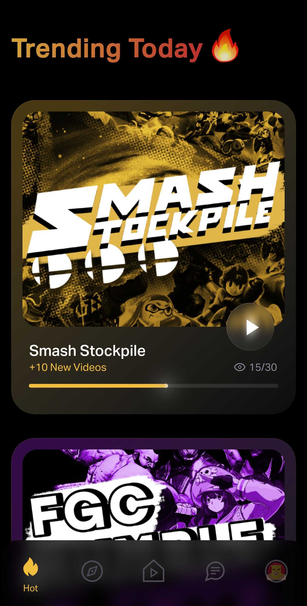

# Glassmorphism UI

A new Flutter project.

## Getting Started

UI based on https://www.figma.com/file/H5Q656sKyzmiFdfuDHNHwu/Trending-Today?node-id=0%3A1

## Assets

The `assets` directory houses images, fonts, and gifs

## App screenshots

